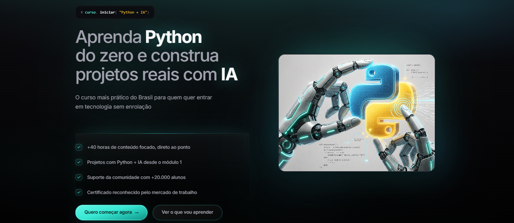
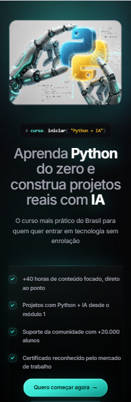

# 🚀 Landing Page — Curso Python + IA

## 📌 Sobre o projeto
Projeto desenvolvido durante uma seleção técnica com o objetivo de criar uma seção *hero* para uma landing page de curso.

O desenvolvimento contou com o apoio do Cursor (editor de código com IA integrada) para acelerar a construção da interface.

---

## 🎯 Objetivo
- Criar uma seção *hero* moderna e atrativa  
- Garantir boa hierarquia visual  
- Desenvolver layout responsivo  
- Aplicar boas práticas de HTML e CSS  

---

## 🛠️ Tecnologias
- HTML5  
- CSS3 (Flexbox e responsividade)  
- Google Fonts  
- Cursor (IA no desenvolvimento)  

---

## ⚠️ Desafios e soluções

**Problemas encontrados:**
- Estrutura HTML duplicada e desorganizada  
- Imagem não preenchia o container  
- Layout quebrando no mobile  
- CSS com conflitos e regras desnecessárias  
- Elementos interferindo no layout  

**Como resolvi:**
- Refatorei o HTML, removendo elementos redundantes  
- Ajustei o layout com `flex` e `object-fit: cover`  
- Corrigi responsividade com media queries  
- Limpei e organizei o CSS  
- Removi elementos que prejudicavam o layout  

---

## 💡 Aprendizados
- IA acelera, mas exige ajustes manuais  
- Estrutura simples evita bugs de layout  
- Pequenos detalhes impactam muito a UI  
- Entender CSS é essencial para corrigir problemas  

---

## 📸 Preview

---

## 🌐 Deploy
*https://hero-landing-page.netlify.app/*

---

## 👩‍💻 Desenvolvedora

Wanessa Antonio  